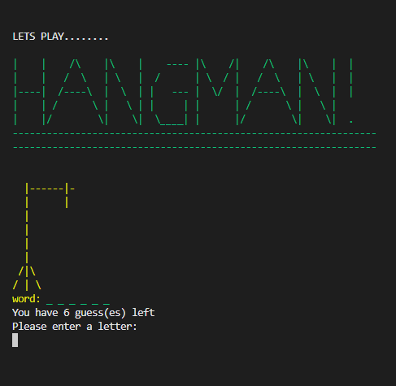
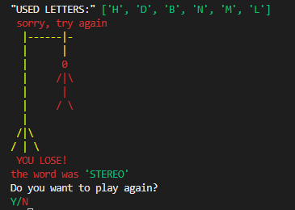
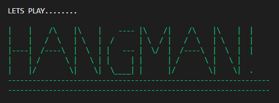
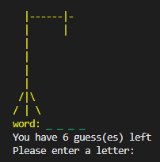
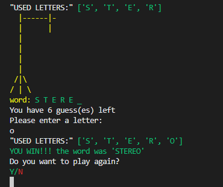
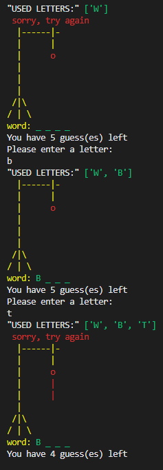
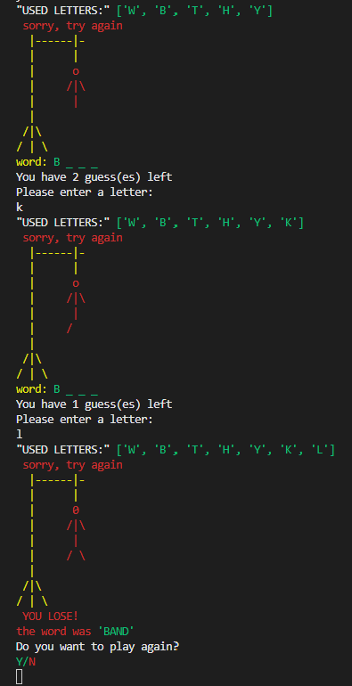
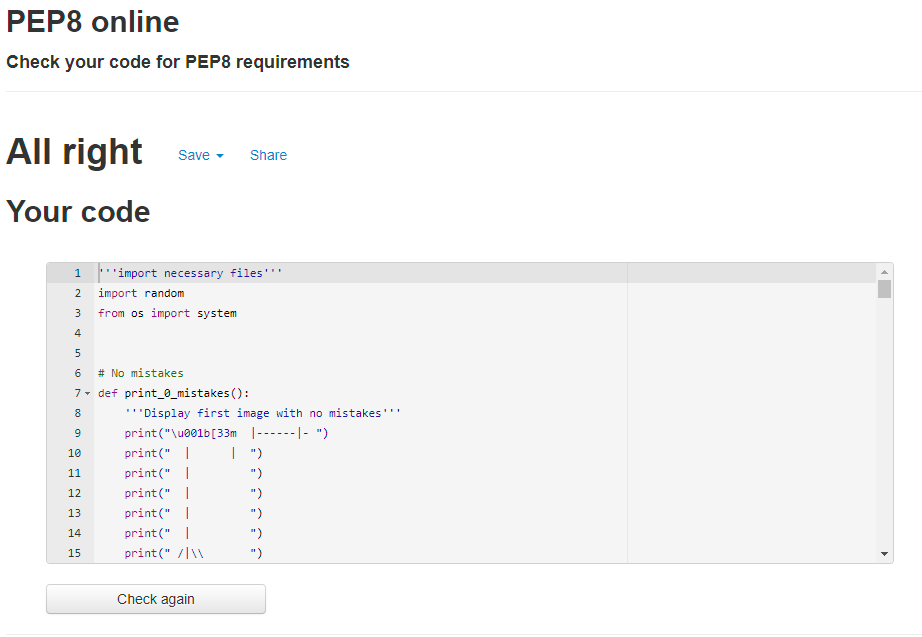

# HANGMAN!!
https://cmd-hangman.herokuapp.com/

## Welcome reader,

In this section I will talk about the project and the issues and fixes that went into creating HANGMAN!

## Project mission:
---

The  aim of the project was to create a command line game in Python that accepts user input to progress through the game. with error messages on mistakes like wrong input types, for instance numbers, spaces, symbols ETC. Even letters already used.

It also has a restart option and  has a clear terminal function before restart to keep it clear for user ease of use.

I've added colour to it to keep the user entertained otherwise it may be a little boring to see a lot of single colour on the screen.

---

## START.....

## END.....

## Aim of the game:
---

The aim of the game is to guess the randomly selected word like traditional hangman without being hung. So you get 6 mistakes before it's too late. You wont lose a life on wrong input types or same letter twice..... I'm not that cruel. But you will obviously lose a life on wrong guesses and each time your wrong, a piece of the man appears in the noose and you continue until you guess the word or hang....GOOD LUCK!

## features:
---

- You are first met with a message asking "Lets play....."
Underneath is a large title of HANGMAN handmade with keyboard symbols and tedious patience.

- Then an empty gallows with a random word ready for you to guess. Marked out with underscores like this _ _ _ _ _  and a message saying "You have 6 guess(es) left please choose a letter".

- If you manage to guess every letter without any mistakes you will only see used letters building and the word appearing in the empty slots with the option to play again.

- If you guess incorrectly you will see parts of the man appearing in the gallows with a "Sorry try again" message and used letter list will continue to build so you can always see what letter you've used.

- If you continue to guess incorrectly of course more of your man will appear and you will get a "YOU LOSE!" message and the mystery word will be shown and you will get another chance to play again.

## Testing:
---

I tested the validation of inputs for example if letter is not in the alphabet then it's not a valid input including numbers spaces etc. and gave a warning message to user
("This not a letter please try again") 

Debugging throughout the project was the first step to testing also due to the nature of the project things won't work unless you have no errors. I also ran the code through PEP8 and came back with no errors.

## Bugs and fixes:
---

- BUG...Trying to create a list of used letters but each time a letter was guessed and added the "Already guessed" message appeared.
- FIX...I moved the error message further down the code away from add to used letters so a list built before error shows.

- BUG...Creating a restart function.
- FIX...Place the actual game loop inside a function then moving all the necessary parts of the code into the function so it can be called.

- BUG...Colouring the code for the user caused everything after to turn that colour.
- FIX...Keep changing the colour on every section and after the section again.

- BUG...I have "try enumerating instead of iterating through range(len(word)).
- FIX...I spoke to Jo on tutor support and I was advised that it will be fine to keep the code as it is.

## Credits:
---

- Thanks to Code Institute for the Love sandwiches walk through for guidance to set up and deployment.

- A big thank you to Jack my mentor for helping me work out the used letters issue and restart issue and for everything else that has made my coding journey easier.

- Many thanks to Jo for easing my mind on the enumerate issue and the package installation process for my project.

- Thanks to ANSI https://www.lihaoyi.com/post/BuildyourownCommandLinewithANSIescapecodes.html#16-colors  for adding colour to my code.

- Thanks to StudentEngineer for showing me that you can clear terminal on restart.

- Thanks to Stack overflow for explaining that I need double \ to show 1 \ in order to build the hangman images. 

## Deployment:
---

- Install requirements file with pip freeze > requirements.txt.
- You will need a Heroku account and sign in here's a link to do so (https://www.heroku.com/).
- On the dashboard select (Create New)
- Name the project, Be sure to name it something unique and select region then press create app.
- Select settings in the sub menu at the top.
- Select reveal config vars and name it CREDS, all capitals.
- Copy the creds.json file and paste it in the value section and press add.
- In the next key put PORT, all capitals and in value put 8000 
- Then press buildpack and add Python then save changes and Nodejs and save changes in that order.
- Now press deploy at the top and select Github then connect to Github.
- Type in the name of the repo and hit search then connect.
- Enable automatic deploy then deploy branch.
- Click on view.

JOB DONE........
